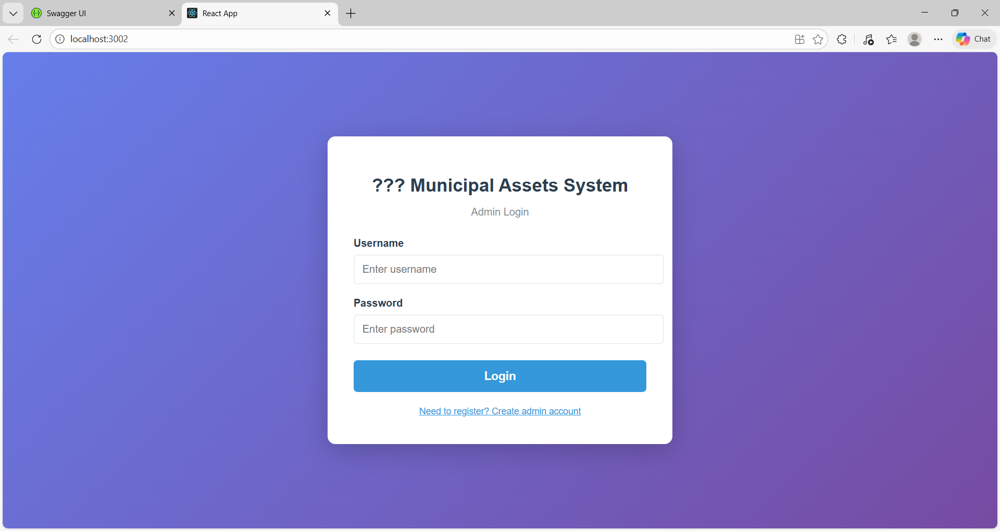
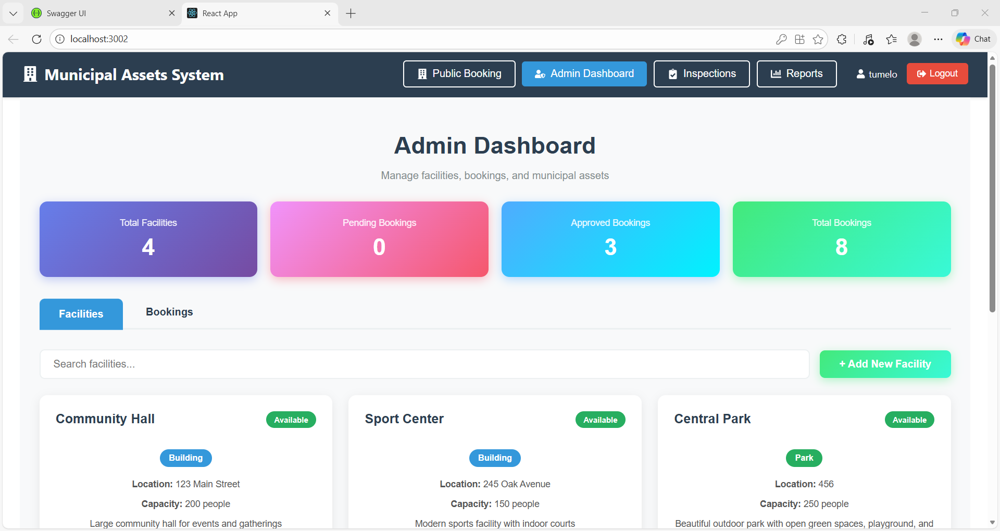
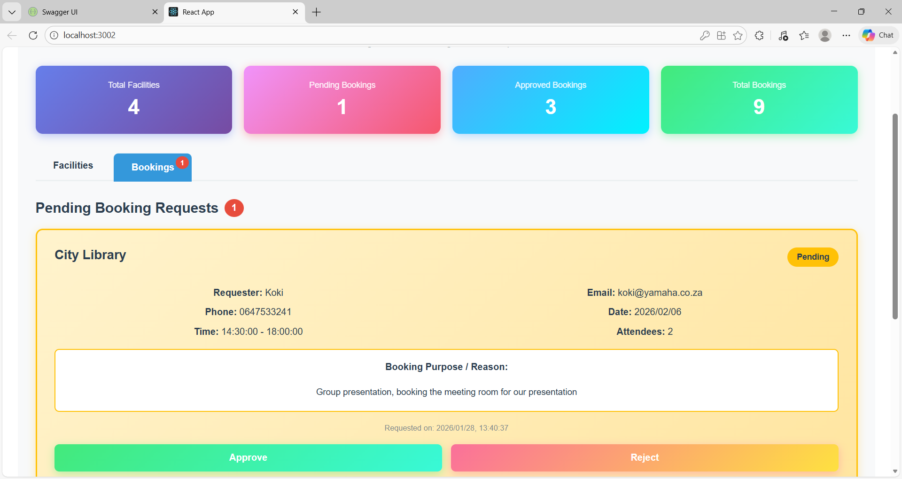
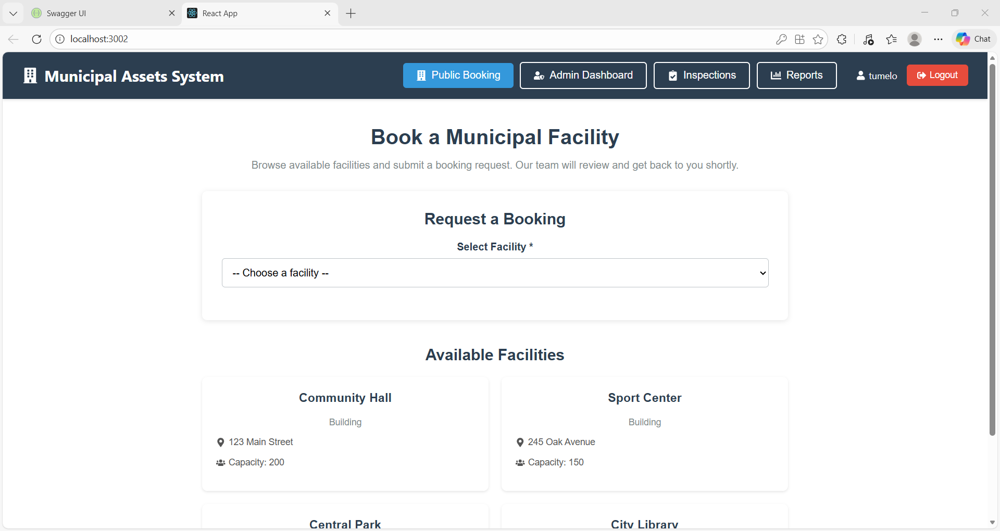
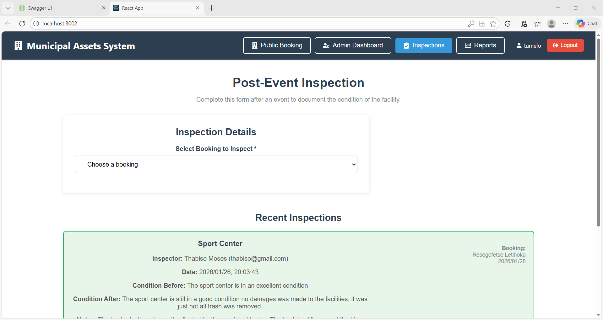
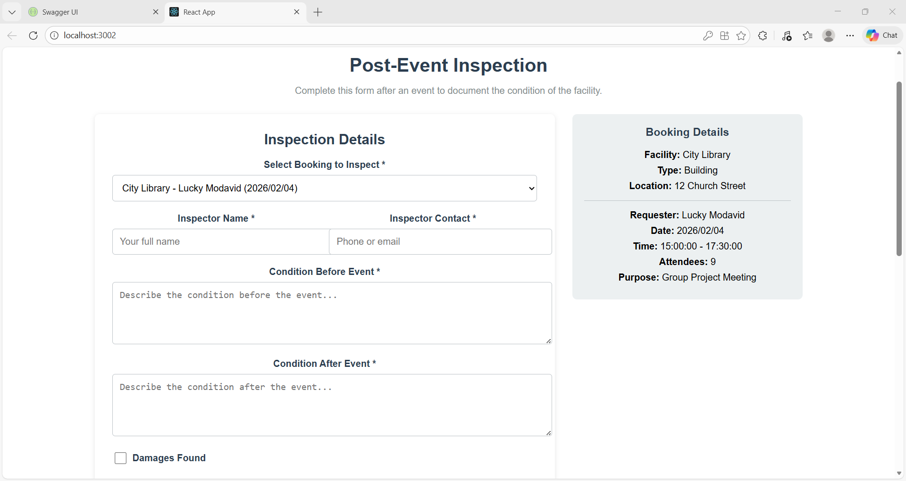
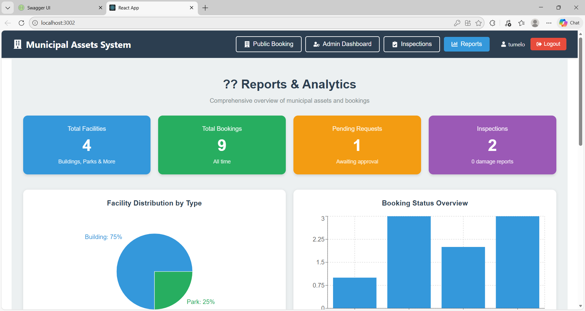
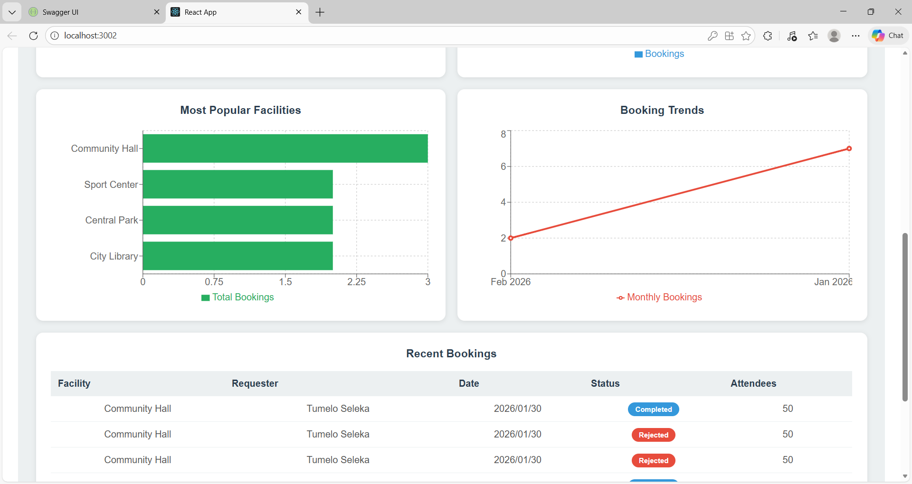

# Municipal Assets Management System

A comprehensive web-based application for managing municipal facilities, bookings, and inspections. This system enables small towns to efficiently manage community buildings, parks, and facilities while providing a seamless booking experience for the public.

## Table of Contents

- [Overview](#overview)
- [Features](#features)
- [Technologies Used](#technologies-used)
- [System Architecture](#system-architecture)
- [Installation Guide](#installation-guide)
- [Usage Instructions](#usage-instructions)
- [API Documentation](#api-documentation)
- [Screenshots](#screenshots)
- [Database Schema](#database-schema)
- [Future Enhancements](#future-enhancements)
- [Contributing](#contributing)
- [Author](#author)

## Overview

The Municipal Assets Management System is designed to streamline the management of public facilities and assets in small municipalities. The system addresses the need for transparent, efficient booking processes and proper asset maintenance tracking. It provides role-based access for administrators and a user-friendly interface for public booking requests.

### Problem Statement

Municipal facilities often face challenges in:
- Coordinating facility bookings manually
- Tracking facility usage and maintenance
- Providing transparency in the approval process
- Documenting facility condition after events
- Generating usage reports and analytics

### Solution

This system provides:
- Automated booking request management
- Centralized facility information
- Digital inspection and damage reporting
- Real-time analytics and reporting
- Transparent approval workflow with mandatory feedback

## Features

### Authentication and Authorization

**Admin Authentication**
- Secure login system with password hashing (SHA256)
- Admin registration for initial setup
- Session management using localStorage
- Protected routes requiring authentication

### Facility Management

**CRUD Operations**
- Create new facilities with detailed information
- Read and search existing facilities
- Update facility details and status
- Delete facilities no longer in use

**Facility Information Tracked**
- Facility name and type (Building, Park, Facility)
- Physical location and address
- Capacity and maximum occupancy
- Available amenities
- Current status (Available, Under Maintenance, Booked)

**Search and Filter**
- Real-time search across facility names
- Filter by facility type
- Location-based search

### Public Booking System

**Booking Request Features**
- Browse all available facilities
- View detailed facility information
- Submit booking requests including:
  - Personal contact information
  - Event date and time range
  - Expected number of attendees
  - Detailed purpose and reason for booking
- View facility capacity and amenities before requesting

**User Interface**
- Responsive design for mobile and desktop
- Facility cards with key information
- Detailed facility view with all specifications

### Administrative Booking Management

**Pending Request Review**
- View all pending booking requests
- Booking purpose prominently displayed for review
- Complete requester information
- Event details and attendance numbers

**Approval Workflow**
- Approve bookings with optional admin notes
- Notes are sent to requester for reference
- One-click approval process

**Rejection Workflow**
- Mandatory rejection reason requirement
- Validation ensures reason is provided
- Rejection reason sent to requester automatically
- Clear communication of decision

**Booking Status Tracking**
- Pending: Awaiting admin review
- Approved: Confirmed bookings
- Rejected: Declined with reason
- Completed: Event finished with inspection

### Post-Event Inspection System

**Inspection Recording**
- Select from approved bookings for inspection
- Record inspector name and contact details
- Document facility condition before event
- Document facility condition after event
- Damage reporting with detailed descriptions
- Additional inspection notes

**Damage Tracking**
- Boolean flag for damages found
- Detailed damage description field
- Photo reference capability (file paths)
- Inspector accountability

**Status Updates**
- Automatic booking status update to "Completed"
- Inspection history tracking
- Link inspections to specific bookings

### Reports and Analytics

**Statistical Overview**
- Total facilities count
- Total bookings (all statuses)
- Pending bookings requiring attention
- Completed inspections
- Damage reports summary

**Visual Analytics**
- Facility distribution by type (Pie Chart)
- Booking status breakdown (Bar Chart)
- Most popular facilities ranking (Horizontal Bar Chart)
- Monthly booking trends (Line Chart)

**Recent Activity**
- Tabular view of recent bookings
- Booking status tracking
- Facility usage patterns

## Technologies Used

### Backend Technologies

**Framework and Runtime**
- ASP.NET Core 8.0 Web API
- .NET 8.0 SDK
- C# 12

**Database and ORM**
- Entity Framework Core 8.0
- SQLite 3 (file-based database)
- Code-First migrations

**Security**
- SHA256 password hashing
- CORS configuration
- Input validation

**Architecture**
- RESTful API design
- Minimal APIs pattern
- Dependency injection
- Repository pattern through EF Core

### Frontend Technologies

**Framework and Libraries**
- React 18
- React Hooks (useState, useEffect)
- React Router (navigation)

**HTTP and State Management**
- Axios for API requests
- localStorage for session management
- Asynchronous state handling

**UI Components and Styling**
- React Icons (Font Awesome icons)
- Recharts (data visualization)
- Inline CSS with gradients and animations
- Responsive grid layouts

**Build Tools**
- Create React App
- Babel transpiler
- Webpack bundler

### Development Tools

- Visual Studio 2022 (Backend IDE)
- Visual Studio Code (Frontend IDE alternative)
- Git for version control
- GitHub for repository hosting
- npm for package management

## System Architecture

### Architecture Pattern

The system follows a three-tier architecture:

**Presentation Layer (Frontend)**
- React single-page application
- Component-based architecture
- Client-side routing
- State management with React Hooks

**Business Logic Layer (Backend)**
- RESTful Web API
- Endpoint-based routing
- Business logic processing
- Authentication and authorization

**Data Layer**
- Entity Framework Core ORM
- SQLite database
- Data models and relationships
- Migration-based schema management

### API Communication Flow
```
Client (React) → HTTP Request (Axios) → API Endpoint (ASP.NET Core)
                                              ↓
                                        Business Logic
                                              ↓
                                    Entity Framework Core
                                              ↓
                                       SQLite Database
```

### Data Models and Relationships

**Facility Model**
- Primary entity for facility management
- One-to-many relationship with Bookings

**Booking Model**
- Links to Facility (many-to-one)
- Links to Inspection (one-to-one)
- Tracks booking lifecycle

**Inspection Model**
- Links to Booking (one-to-one)
- Stores post-event data

**Admin Model**
- Stores administrator credentials
- Password stored as hashed value

## Installation Guide

### Prerequisites

Before installation, ensure you have:

1. **.NET 8.0 SDK**
   - Download from: https://dotnet.microsoft.com/download/dotnet/8.0
   - Verify installation: `dotnet --version`

2. **Node.js (v16 or higher)**
   - Download from: https://nodejs.org/
   - Verify installation: `node --version` and `npm --version`

3. **Visual Studio 2022** (Recommended)
   - Community Edition or higher
   - With ASP.NET and web development workload

4. **Git**
   - Download from: https://git-scm.com/
   - For cloning the repository

### Backend Installation Steps

**Step 1: Clone the Repository**
```bash
git clone https://github.com/Tumelo1801/Municipal-Assets-System.git
cd Municipal-Assets-System
```

**Step 2: Open Solution in Visual Studio**
```bash
# Open the .sln file
start MunicipalAssetsSystem.sln
```

Or open Visual Studio 2022 manually and select "Open a project or solution"

**Step 3: Restore NuGet Packages**

In Visual Studio:
1. Right-click on Solution in Solution Explorer
2. Select "Restore NuGet Packages"

Or via command line:
```bash
dotnet restore
```

**Step 4: Update Database**

Open Package Manager Console in Visual Studio:
- Tools → NuGet Package Manager → Package Manager Console

Run:
```powershell
Update-Database
```

This creates the SQLite database file with all required tables.

**Step 5: Run the Backend**

Press F5 in Visual Studio or run:
```bash
dotnet run
```

The API will start at: `http://localhost:5242`

Verify by navigating to: `http://localhost:5242/swagger`

### Frontend Installation Steps

**Step 1: Navigate to Client App Directory**
```bash
cd client-app
```

**Step 2: Install Dependencies**
```bash
npm install
```

This installs all required packages:
- React and React DOM
- Axios for HTTP requests
- React Icons
- Recharts for data visualization

**Step 3: Start Development Server**
```bash
npm start
```

The React app will automatically open at: `http://localhost:3000`

If port 3000 is busy, it will prompt you to use another port (3001, 3002, etc.)

### Verification Steps

After installation, verify the system:

1. **Backend is Running**
   - Visit: `http://localhost:5242/swagger`
   - Should see API documentation

2. **Frontend is Running**
   - Visit: `http://localhost:3000`
   - Should see the Municipal Assets System interface

3. **API Connection**
   - Frontend should display available facilities (if any exist)
   - Check browser console (F12) for connection errors

## Usage Instructions

### Initial Setup

**First-Time Administrator Registration**

1. Start both backend and frontend applications
2. Navigate to the application in your browser
3. Click on "Admin Dashboard" or "Inspections" (requires authentication)
4. On the login page, click "Need to register? Create admin account"
5. Fill in the registration form:
   - Full Name
   - Email Address
   - Username
   - Password
6. Click "Register Admin"
7. You will be redirected to login

**Administrator Login**

1. Enter your username and password
2. Click "Login"
3. You will be redirected to Admin Dashboard

### Adding Facilities

**Step-by-Step Process**

1. Login as administrator
2. Navigate to "Admin Dashboard"
3. Ensure you are on the "Facilities" tab
4. Click the "+ Add New Facility" button
5. Fill in the facility information:
   - **Facility Name**: Descriptive name (e.g., "Community Hall")
   - **Type**: Select Building, Park, or Facility
   - **Location**: Full address
   - **Capacity**: Maximum number of people
   - **Description**: Detailed description of the facility
   - **Amenities**: Comma-separated list (e.g., "Kitchen, Parking, WiFi")
6. Click "Add Facility"
7. The facility will appear in the facilities grid

**Editing Facilities**

1. Locate the facility in the grid
2. Click "Edit" button on the facility card
3. Modify the information as needed
4. Click "Update Facility"

**Deleting Facilities**

1. Locate the facility in the grid
2. Click "Delete" button
3. Confirm the deletion in the popup
4. Facility will be permanently removed

### Managing Bookings (Admin)

**Reviewing Pending Bookings**

1. Login as administrator
2. Navigate to "Admin Dashboard"
3. Click the "Bookings" tab
4. Pending bookings are displayed at the top
5. For each booking, review:
   - Facility name
   - Requester information (name, email, phone)
   - Event date and time
   - Expected attendees
   - **Booking Purpose** (highlighted in yellow box for emphasis)
   - Request submission date

**Approving a Booking**

1. Review the booking details and purpose
2. Click "Approve" button
3. Optionally add admin notes (e.g., "Confirmed for afternoon event")
4. Click OK in the prompt
5. Booking moves to "Approved Bookings" section
6. Requester receives confirmation (via admin notes if provided)

**Rejecting a Booking**

1. Review the booking details and purpose
2. Click "Reject" button
3. **Required**: Enter a detailed rejection reason
   - Example: "Facility already booked for that date"
   - Example: "Event exceeds facility capacity"
4. Click OK in the prompt
5. If no reason provided, system will require it
6. Booking is rejected and reason is sent to requester

**Viewing Approved Bookings**

1. Scroll down in the Bookings tab
2. "Approved Bookings" section shows all confirmed events
3. View admin notes added during approval
4. Track upcoming events

### Public Booking Process

**Browsing Facilities**

1. Navigate to "Public Booking" in the navigation bar
2. No login required for public access
3. View all available facilities with:
   - Facility name and type
   - Location
   - Capacity

**Submitting a Booking Request**

1. Click on a facility card or select from dropdown
2. Fill in the booking form:
   - **Your Name**: Full name
   - **Email Address**: Contact email
   - **Phone Number**: Contact phone
   - **Booking Date**: Select date from calendar
   - **Start Time**: Event start time
   - **End Time**: Event end time
   - **Expected Attendees**: Number of people
   - **Purpose of Booking**: Detailed description of event/purpose
3. Review facility details displayed on the right
4. Click "Submit Booking Request"
5. You will receive confirmation message
6. Wait for admin to review and approve/reject

### Conducting Inspections

**Creating a Post-Event Inspection**

1. Login as administrator
2. Navigate to "Inspections"
3. Select a booking from the dropdown (only approved bookings shown)
4. Fill in inspection details:
   - **Inspector Name**: Your name or inspector's name
   - **Inspector Contact**: Phone or email
   - **Condition Before Event**: Describe facility state before event
   - **Condition After Event**: Describe facility state after event
   - **Damages Found**: Check if any damages were found
   - If damages found:
     - **Damage Description**: Required, detailed description
5. Add any additional notes
6. Click "Submit Inspection"
7. Booking status automatically updates to "Completed"

**Viewing Inspection History**

1. Scroll down in Inspections page
2. "Recent Inspections" section shows all completed inspections
3. Inspections with damages are highlighted in red
4. View inspector details and findings

### Viewing Reports and Analytics

1. Login as administrator
2. Navigate to "Reports"
3. View statistics cards at the top:
   - Total facilities
   - Total bookings
   - Pending requests
   - Inspections with damage count
4. Review charts:
   - **Facility Distribution**: Pie chart of facility types
   - **Booking Status**: Bar chart of booking statuses
   - **Most Popular Facilities**: Horizontal bar chart
   - **Booking Trends**: Line chart of bookings over time
5. Check "Recent Bookings" table at bottom for latest activity

## API Documentation

### Base URL
```
http://localhost:5242/api
```

### Authentication Endpoints

**Register Admin**
```http
POST /api/auth/register
Content-Type: application/json

{
  "username": "admin",
  "password": "securepassword",
  "fullName": "Admin User",
  "email": "admin@municipality.com"
}
```

Response:
```json
{
  "message": "Admin registered successfully"
}
```

**Login**
```http
POST /api/auth/login
Content-Type: application/json

{
  "username": "admin",
  "password": "securepassword"
}
```

Response:
```json
{
  "success": true,
  "adminId": 1,
  "username": "admin",
  "fullName": "Admin User",
  "email": "admin@municipality.com"
}
```

### Facility Endpoints

**Get All Facilities**
```http
GET /api/facilities
```

Response:
```json
[
  {
    "id": 1,
    "name": "Community Hall",
    "type": "Building",
    "location": "123 Main Street",
    "description": "Large community hall for events",
    "capacity": 200,
    "amenities": "Stage, Sound System, Kitchen",
    "status": "Available",
    "createdDate": "2024-01-20T10:00:00Z"
  }
]
```

**Get Facility by ID**
```http
GET /api/facilities/{id}
```

**Create Facility**
```http
POST /api/facilities
Content-Type: application/json

{
  "name": "Community Hall",
  "type": "Building",
  "location": "123 Main Street",
  "description": "Large community hall for events",
  "capacity": 200,
  "amenities": "Stage, Sound System, Kitchen",
  "status": "Available"
}
```

**Update Facility**
```http
PUT /api/facilities/{id}
Content-Type: application/json

{
  "id": 1,
  "name": "Community Hall Updated",
  "type": "Building",
  "location": "123 Main Street",
  "description": "Updated description",
  "capacity": 250,
  "amenities": "Stage, Sound System, Kitchen, WiFi",
  "status": "Available"
}
```

**Delete Facility**
```http
DELETE /api/facilities/{id}
```

### Booking Endpoints

**Get All Bookings**
```http
GET /api/bookings
```

**Get Bookings by Status**
```http
GET /api/bookings/status/{status}
```

Status values: `Pending`, `Approved`, `Rejected`, `Completed`

**Create Booking**
```http
POST /api/bookings
Content-Type: application/json

{
  "facilityId": 1,
  "requesterName": "John Doe",
  "requesterEmail": "john@example.com",
  "requesterPhone": "555-1234",
  "bookingDate": "2024-02-15T00:00:00Z",
  "startTime": "10:00:00",
  "endTime": "14:00:00",
  "purpose": "Community meeting",
  "expectedAttendees": 50
}
```

**Update Booking Status**
```http
PUT /api/bookings/{id}/status?status=Approved&adminNotes=Confirmed
```

Parameters:
- `status`: Approved | Rejected
- `adminNotes`: Optional admin notes (mandatory for rejection)

### Inspection Endpoints

**Get All Inspections**
```http
GET /api/inspections
```

**Get Inspections by Booking**
```http
GET /api/inspections/booking/{bookingId}
```

**Create Inspection**
```http
POST /api/inspections
Content-Type: application/json

{
  "bookingId": 1,
  "inspectorName": "Jane Smith",
  "inspectorContact": "jane@municipality.com",
  "conditionBefore": "Clean, all equipment in place",
  "conditionAfter": "Minor cleanup needed",
  "damagesFound": false,
  "damageDescription": null,
  "inspectionNotes": "Event went smoothly"
}
```

## Screenshots

### Login Page


The authentication screen where administrators securely log in to access admin features. Includes options for new admin registration.

### Admin Dashboard - Facilities Management


Comprehensive facility management interface with search functionality, add/edit/delete capabilities, and detailed facility information cards.

### Admin Dashboard - Booking Management


Booking request review screen highlighting the purpose of each booking prominently. Administrators can approve with notes or reject with mandatory reasons.

### Public Booking Interface


User-friendly interface for browsing available facilities with key information displayed.



Detailed booking request form where public users submit their facility booking requests with all necessary information.

### Inspection System


Post-event inspection interface for recording facility condition before and after events, with damage reporting capabilities.



Complete inspection history with damage reports highlighted for administrator review and facility maintenance planning.

### Reports and Analytics


Statistical overview with key metrics and visual analytics including pie charts, bar charts, and trend lines.



Comprehensive analytics showing booking trends, popular facilities, and recent activity table for informed decision-making.

## Database Schema

### Facilities Table

| Column | Type | Description |
|--------|------|-------------|
| Id | INTEGER | Primary key, auto-increment |
| Name | TEXT | Facility name |
| Type | TEXT | Building, Park, or Facility |
| Location | TEXT | Physical address |
| Description | TEXT | Detailed description |
| Capacity | INTEGER | Maximum occupancy |
| Amenities | TEXT | Available amenities |
| Status | TEXT | Available, Under Maintenance, Booked |
| CreatedDate | DATETIME | Timestamp of creation |

### Bookings Table

| Column | Type | Description |
|--------|------|-------------|
| Id | INTEGER | Primary key, auto-increment |
| FacilityId | INTEGER | Foreign key to Facilities |
| RequesterName | TEXT | Name of person requesting booking |
| RequesterEmail | TEXT | Contact email |
| RequesterPhone | TEXT | Contact phone number |
| BookingDate | DATETIME | Date of event |
| StartTime | TEXT | Event start time (HH:MM:SS) |
| EndTime | TEXT | Event end time (HH:MM:SS) |
| Purpose | TEXT | Reason for booking |
| ExpectedAttendees | INTEGER | Number of expected attendees |
| Status | TEXT | Pending, Approved, Rejected, Completed |
| RequestDate | DATETIME | Timestamp of request submission |
| AdminNotes | TEXT | Optional admin comments |

### Inspections Table

| Column | Type | Description |
|--------|------|-------------|
| Id | INTEGER | Primary key, auto-increment |
| BookingId | INTEGER | Foreign key to Bookings |
| InspectorName | TEXT | Name of inspector |
| InspectorContact | TEXT | Inspector contact information |
| InspectionDate | DATETIME | Timestamp of inspection |
| ConditionBefore | TEXT | Facility condition before event |
| ConditionAfter | TEXT | Facility condition after event |
| DamagesFound | BOOLEAN | Whether damages were found |
| DamageDescription | TEXT | Details of any damages |
| DamagePhotos | TEXT | File paths for damage photos |
| InspectionNotes | TEXT | Additional inspector notes |

### Admins Table

| Column | Type | Description |
|--------|------|-------------|
| Id | INTEGER | Primary key, auto-increment |
| Username | TEXT | Unique username |
| PasswordHash | TEXT | SHA256 hashed password |
| FullName | TEXT | Administrator full name |
| Email | TEXT | Administrator email |
| CreatedDate | DATETIME | Account creation timestamp |

### Relationships

- Facilities (1) → (Many) Bookings
- Bookings (1) → (1) Inspections
- Bookings (Many) → (1) Facilities

## Future Enhancements

### Planned Features

**Email Notifications**
- Automated emails to requesters on approval/rejection
- Reminder emails for upcoming events
- Admin notifications for new booking requests

**Calendar Integration**
- Visual calendar view of bookings
- Drag-and-drop rescheduling
- Conflict detection and prevention

**Enhanced Reporting**
- Export reports to PDF/Excel
- Custom date range analytics
- Revenue tracking (if fees are implemented)
- Facility utilization rates

**File Upload System**
- Photo uploads for facility listings
- Document attachments for bookings
- Damage photos in inspection reports

**Mobile Application**
- Native iOS and Android apps
- Push notifications
- Offline capability for inspections

**Multi-Language Support**
- Internationalization (i18n)
- Support for multiple languages
- Region-specific date/time formats

**Advanced Search**
- Filter by amenities
- Capacity-based search
- Availability calendar search
- Price range filtering (if fees added)

**Maintenance Scheduling**
- Planned maintenance calendar
- Automatic facility status updates
- Maintenance history tracking

**User Roles**
- Multiple admin levels (Super Admin, Facility Manager)
- Inspector-specific accounts
- Public user accounts for booking history

## Contributing

Contributions to the Municipal Assets Management System are welcome. To contribute:

### How to Contribute

1. **Fork the Repository**
```bash
   git clone https://github.com/Tumelo1801/Municipal-Assets-System.git
```

2. **Create a Feature Branch**
```bash
   git checkout -b feature/YourFeatureName
```

3. **Make Your Changes**
   - Follow the existing code style
   - Add comments for complex logic
   - Update documentation as needed

4. **Test Your Changes**
   - Ensure all existing tests pass
   - Add new tests for new features
   - Test on both backend and frontend

5. **Commit Your Changes**
```bash
   git commit -m "Add detailed description of your changes"
```

6. **Push to Your Fork**
```bash
   git push origin feature/YourFeatureName
```

7. **Submit a Pull Request**
   - Provide a clear description of changes
   - Reference any related issues
   - Wait for code review

### Code Style Guidelines

**C# Backend**
- Follow Microsoft C# coding conventions
- Use meaningful variable and method names
- Add XML documentation comments for public methods
- Keep methods focused and single-purpose

**JavaScript Frontend**
- Use functional components with hooks
- Follow React best practices
- Use meaningful component and variable names
- Keep components focused and reusable

### Reporting Issues

When reporting issues, please include:
- Clear description of the problem
- Steps to reproduce
- Expected vs actual behavior
- Screenshots if applicable
- System information (OS, browser, .NET version)

## Author

**Tumelo Seleka**

- GitHub: [Tumelo1801](https://github.com/Tumelo1801)
- Project Repository: [Municipal-Assets-System](https://github.com/Tumelo1801/Municipal-Assets-System)

### Acknowledgments

This project was developed as a practical solution for municipal asset management challenges faced by small towns. Special thanks to all who provided feedback and testing support during development.
